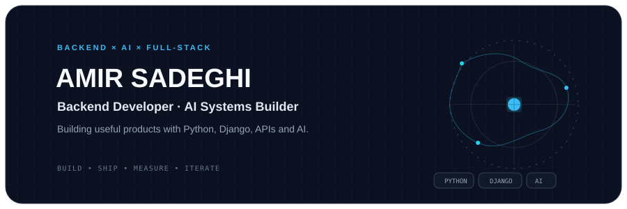
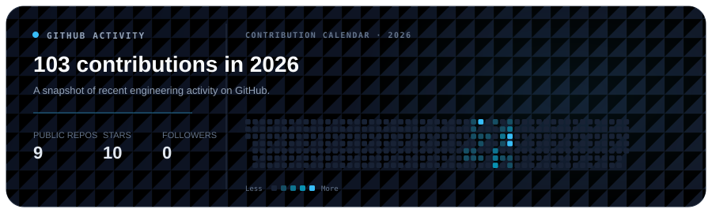

<div align="center">



</div>

<div align="center">

[](https://github.com/AmirSadeghiH)
[](https://www.linkedin.com/in/amir-sadeghi-680548417/)
[](https://www.python.org/)
[](https://www.djangoproject.com/)
[](#ai--engineering)

</div>

<br/>

## About

I'm **Amir Sadeghi**, a developer focused on **backend engineering, AI-powered systems, and product development**.

I enjoy taking an idea from concept to a working system: designing the backend, building APIs, integrating AI, deploying the product, and improving it through real usage.

My current direction is **Full-Stack Development**, with **Python backend engineering** as my strongest foundation.

```text
Backend        → Python · Django · Django REST Framework · FastAPI
AI / Data      → RAG · LLMs · Embeddings · Machine Learning
Frontend       → HTML · CSS · JavaScript
Infrastructure → Docker · Linux · Nginx · Git · GitHub · PostgreSQL
```

<div align="center"></div>

## Featured Projects

<table><tr><td width="50%" valign="top">

### Website AI Assistant

AI-powered website customer support built around **RAG, LLMs and Django**.

`Python` `Django` `DRF` `RAG` `LLM` `Docker`

[View repository →](https://github.com/AmirSadeghiH/Website-AI-Assistant)

</td><td width="50%" valign="top">

### CarSanj.ir

Used-car price estimation platform combining **Django, marketplace data and machine learning**.

`Python` `Django` `ML` `Random Forest` `RAG`

</td></tr><tr><td width="50%" valign="top">

### LogGame

A Persian gaming platform evolving around **games, content, community and personalization**.

`Python` `Django` `JavaScript` `HTML/CSS`

</td><td width="50%" valign="top">

### Melody-baz

Telegram social playlist bot with music discovery, playlists, referrals and progression systems.

`Python` `Telegram` `Async SQLAlchemy` `Pydantic`

[View repository →](https://github.com/AmirSadeghiH/Melody-baz)

</td></tr></table>

<div align="center"></div>

## AI & Engineering

I'm most interested in the engineering behind AI products: making systems useful, reliable, efficient and deployable.

| Area | Focus |
| --- | --- |
| **RAG** | Retrieval pipelines, embeddings, chunking and evaluation |
| **LLM Systems** | Context, cost optimization and reliability |
| **AI Agents** | Tool use, workflows and task execution |
| **Backend** | APIs, architecture, security, performance and scalability |
| **DevOps** | Docker, Linux, deployment and production fundamentals |

## Currently Building

```text
01  Production-ready backend architecture
02  AI / RAG systems that solve real problems
03  Full-stack development skills
04  Deployment and DevOps fundamentals
05  Small open-source tools for developers
```

## Tech Stack

### Core
<p></p>

### Web
<p></p>

### Infrastructure & Workflow
<p></p>

<div align="center"></div>

## GitHub Activity

<div align="center">



</div>

<div align="center"></div>

## Engineering Philosophy

> **Build real things. Understand how they work. Break them. Fix them. Ship them.**

I care more about understanding systems and building useful software than collecting technologies.

## Connect

<div align="center">

[](https://github.com/AmirSadeghiH)
[](https://www.linkedin.com/in/amir-sadeghi-680548417/)

</div>

<br/>

<div align="center"><sub>Build systems. Ship products. Keep learning.</sub></div>
